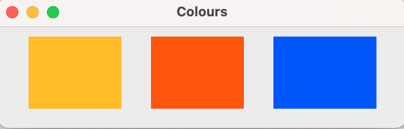
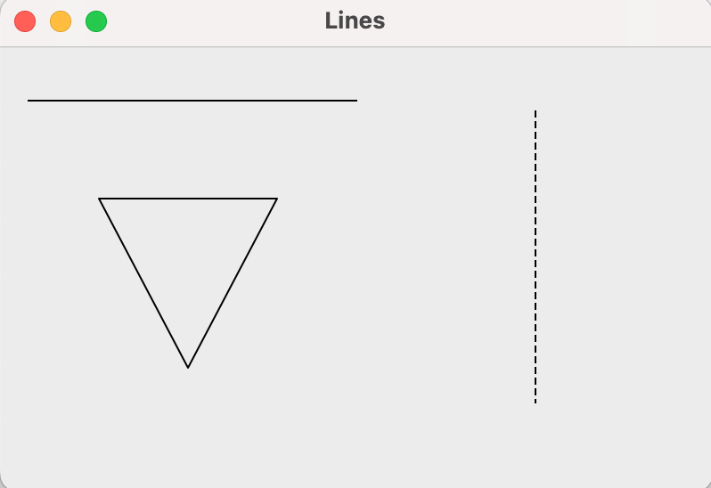
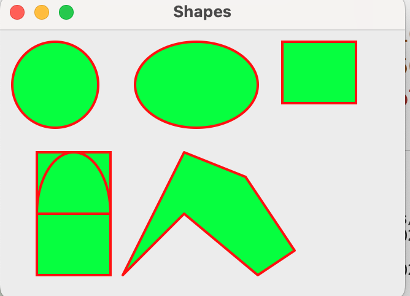
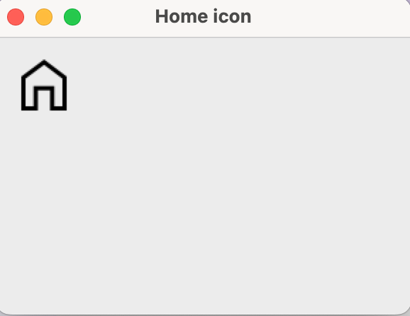
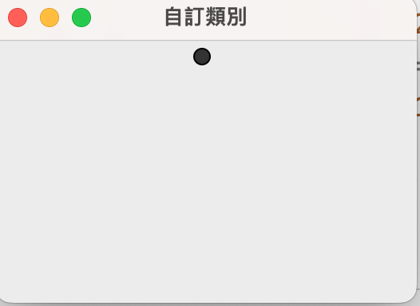
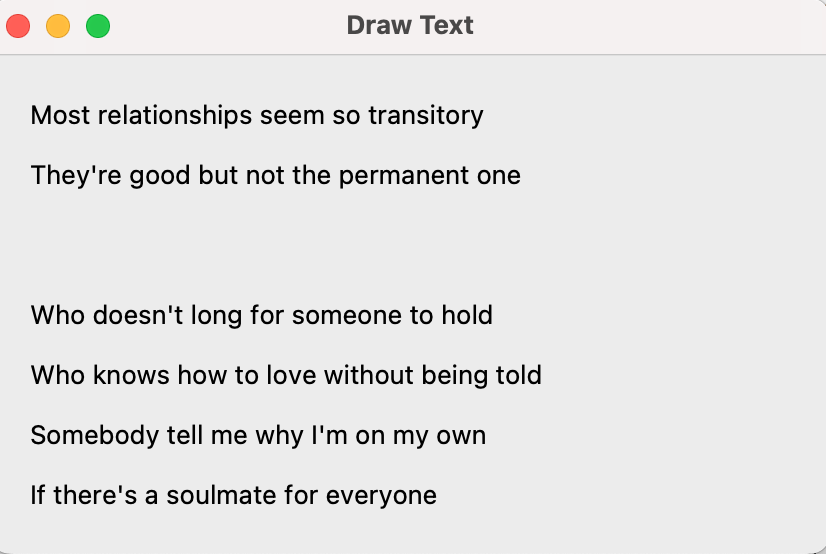

# 請將pythonWindow內的繪圖部份,做一次 #248

## [color.py](color.py)

## [drawlines.py](drawLines.py)

## [geometric.py](gemoetric.py)

## [image.py](image.py)

## [inheritance.py](inheritance.py)

## [text.py](text.py)
